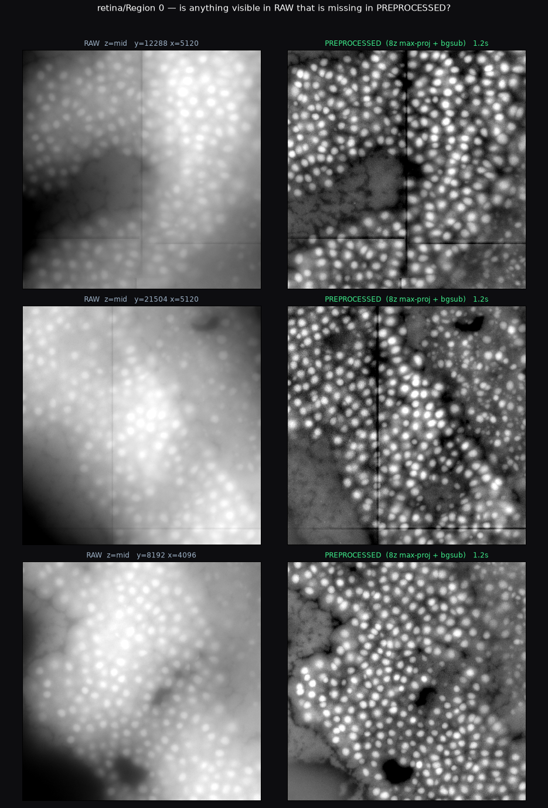
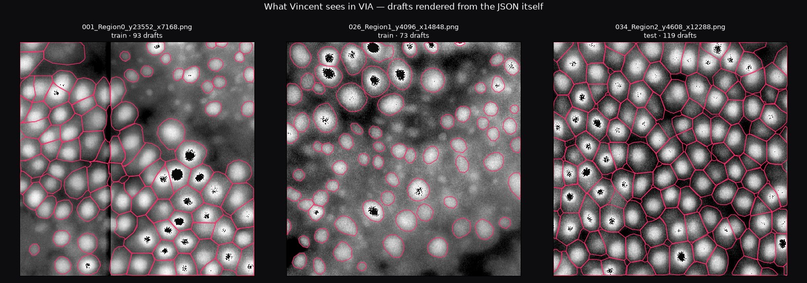

# merscope-seg

Cell/nucleus segmentation pipeline for Vizgen MERSCOPE whole-slide mosaics
(NEI retina & brain data). Phase 1: gigapixel-safe reading, preprocessing,
and an annotation package for building ground truth.

**Status:** pre-annotation. Preprocessing + annotation tooling built and tested;
model training starts once the first corrected annotations exist.

## Why preprocessing is the centerpiece

On dense retina tissue, the raw mosaics give an off-the-shelf model essentially
nothing: raw z0 yielded ~0 detections per tile even after a 180-combination
parameter sweep. The same model with **max-projection over all 8 z-planes +
local background subtraction** finds hundreds of nuclei per tile. Input
preparation, not model choice, is the first-order lever on this data.



## What's here

```
mseg/
  config.py       PreprocessConfig — the recipe, hashed to a recipe_id for provenance
  regions.py      Region/Catalog — lazy memmap windows into untiled 0.6–17 GB TIFFs
  preprocess.py   z-projection → (optional destripe) → background subtract → clip
                  * brightness-only by contract: geometry asserted on every call
                  * background estimated on tile + 3σ margin, then cropped —
                    prevents per-tile seams in the background estimate
                  * Otsu-based is_tissue() tile gating (most of each frame is empty)
                  * anchor() — raw-coordinate provenance stored with every tile
  annot.py        converters: label mask ↔ VIA polygon JSON ↔ RLE CSV
                  (RLE format per Volkov RPE tooling: ID, Frame, y, xL, xR)
scripts/
  make_manifest.py             inventory all regions (header-only, seconds)
  render_sheets.py             raw-vs-preprocessed sheets for expert review
  build_annotation_package.py  tile selection → Cellpose drafts → VIA package
tests/
  test_preprocess.py  synthetic-image tests: geometry, margin-vs-global bgsub
                      (<2% diff), seam consistency, projection, provenance
  test_annot.py       round-trips: mask→VIA→mask IoU>0.93/object, mask→RLE→mask exact
out/annotation_package/   the package annotators receive (see below)
```

## The annotation package

Correct-not-draw: a model pre-draws draft outlines; the annotator fixes them
in [VIA](https://www.robots.ox.ac.uk/~vgg/software/via/) — a single HTML file,
runs offline in any browser, zero install. Export lands as
`*_annotations_via.json`, directly compatible with RPE_Segmentation's
`rpe_dataset.py`, so Mask R-CNN training is turnkey from the same file.

Current build: **40 × 512px DAPI tiles** (Region 0 ×12 + Region 1 ×16 = train,
Region 2 ×12 = held-out test; first 3 tiles = pilot), **3,252 draft outlines**
from zero-shot Cellpose-SAM. Split is by *region*, never by tile.



*Drafts rendered directly from the shipped JSON — what the annotator sees and
corrects. Left/right: dense tiles where the work is deleting/splitting; middle:
a dim tile where drafts under-detect and the work is adding.*

<!-- TODO: real VIA UI screenshot — open out/annotation_package/via.html,
     load a tile + drafts, Cmd+Shift+4, save as docs/img/via_ui.png -->

## Design decisions worth knowing

1. **Annotations are coordinates, not pictures.** Every tile ships with an
   `anchor` (region, origin, z-planes, recipe_id). Preprocessing may change
   brightness only — never pixel positions (asserted). If the recipe improves
   later, tiles are re-rendered and existing labels drop straight on top:
   zero re-annotation cost.
2. **Background margin.** A σ=60 Gaussian background estimated per-tile creates
   visible seams between neighbouring tiles; we read tile+180px, subtract, then
   crop. Verified against global subtraction to <2% in tests.
3. **Region-level splits.** Neighbouring tiles are near-duplicates; splitting
   by tile leaks and overstates accuracy. Regions 0+1 train, Region 2 is the
   exam, Region 3 stays sealed.
4. Known display quirk: hard percentile clipping renders some in-core dips as
   black pips. Cosmetic (raw verified healthy; detection counts stable under
   σ 60→120 A/B) — re-render freely if it bothers annotators.

## Run it

```
conda activate cellpose          # python 3.11 + tifffile scipy scikit-image cellpose torch
python tests/test_preprocess.py
python tests/test_annot.py
python scripts/make_manifest.py
python scripts/build_annotation_package.py
```

Data is NOT in this repo (expects `/Users/Projects/Data/retina/Region N/`
with `mosaic_<CH>_z<N>.tif`). via.html is © VGG, BSD-2 — see their site.
